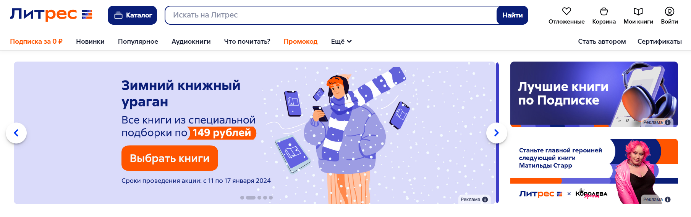
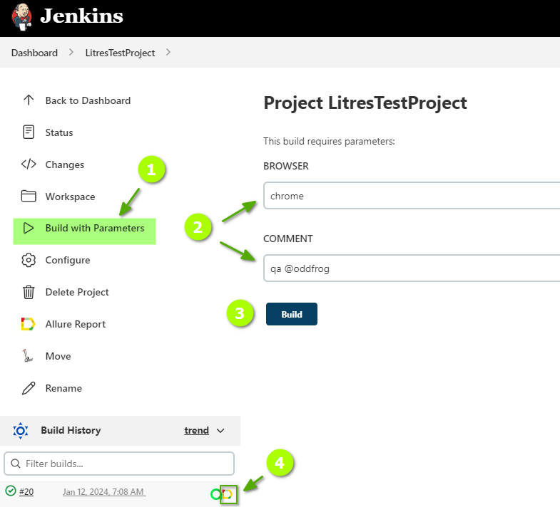
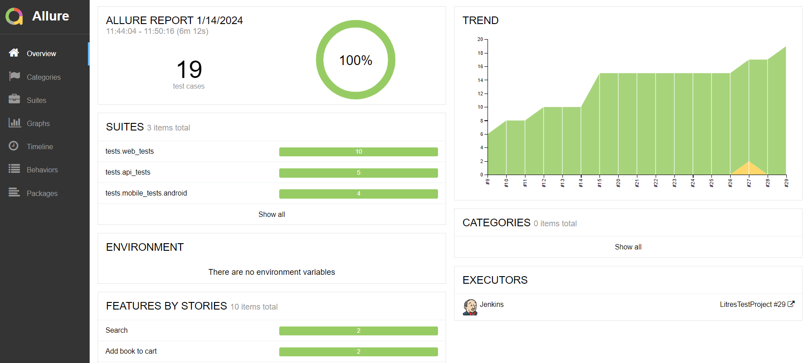
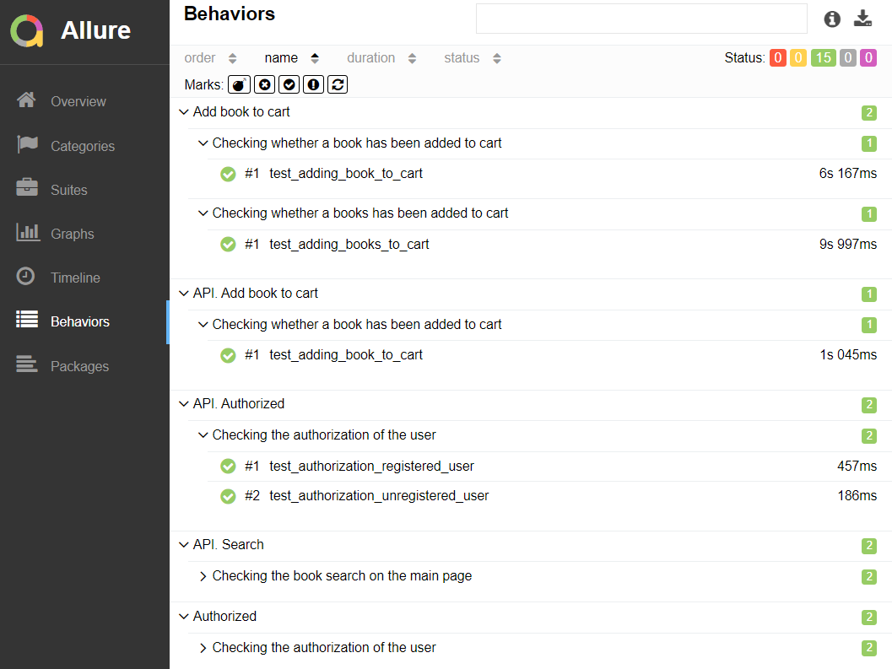
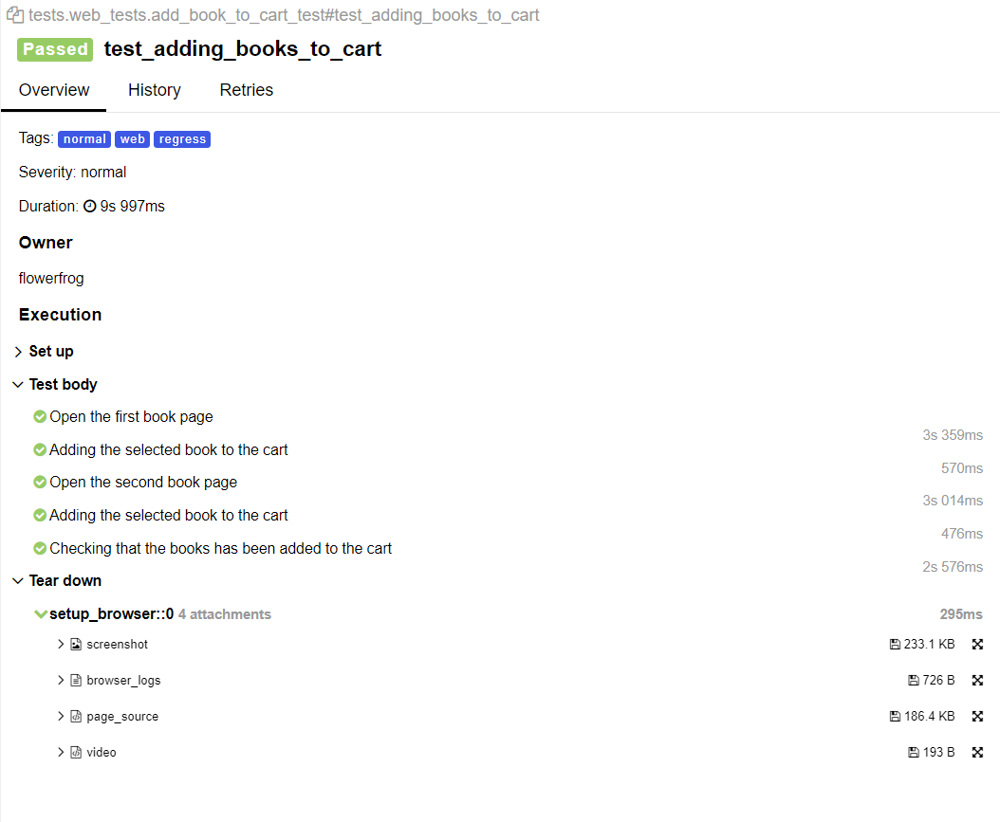
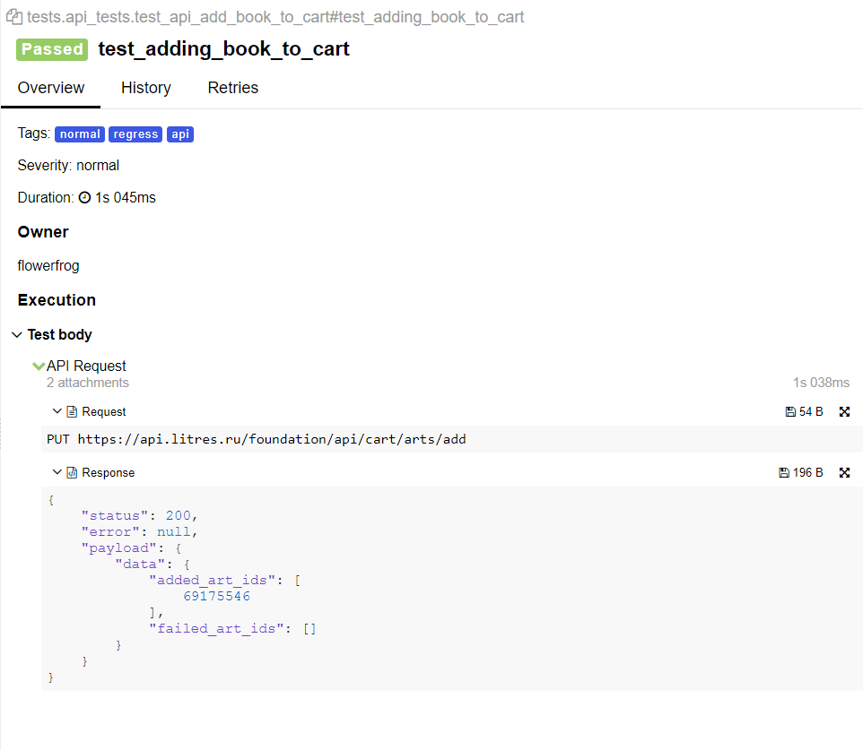

<h1> Проект по тестированию сервиса электронных и аудиокниг "Литрес"</h1>

> <a target="_blank" href="https://www.litres.ru">Ссылка на сайт</a>

<u><h3> Список проверок, реализованных в автотестах:</h3></u>

>### UI-тесты
- [x] Авторизация пользователя на сайте(успешная и неуспешная)
- [x] Поиск книги
- [x] Добавление книги в корзину
- [x] Удаление книги из корзины
- [x] Добавление книги в Избранное
- [x] Удаление книги из Избранного

>### API-тесты
- [x] Авторизация пользователя на сайте(успешная и неуспешная)
- [x] Поиск книги
- [x] Добавление книги в корзину

----
### Проект реализован с использованием:
          

----
### Запуск автотестов выполняется на сервере Jenkins
> <a target="_blank" href="https://jenkins.autotests.cloud/job/LitresTestProject/">Ссылка на проект в Jenkins</a>

#### Параметры сборки

* `browser` - параметр определяет браузер для запуска тестов

* `comment` - комментарий

#### Для запуска автотестов в Jenkins

1. Открыть <a target="_blank" href="https://jenkins.autotests.cloud/job/LitresTestProject/">проект</a>
2. Выбрать пункт `Build with Parameters`
3. Указать браузер
4. Указать комментарий
5. Нажать кнопку `Build`
6. Результат запуска сборки можно посмотреть в отчёте Allure

----
### Allure отчет

#### Общие результаты

#### Список тест кейсов

#### Пример отчета о прохождении ui-теста

#### Пример отчета о прохождении api-теста

----